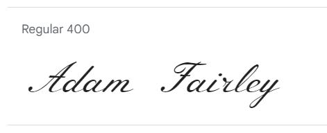
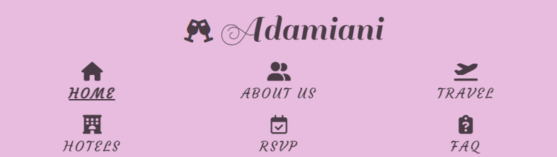

---

# Adamiani

### This site is designed as a vow renewal website to be used by those invited to the festivities.

Adamiani is an informative wedding-vow renewal website with the aim of providing the invited guests with a convenient, yet stylish, repository of information regarding the upcoming event. It provides value through its RSVP form, travel and accommodation details, contact details, and the celebration schedule. The development followed a mobile-first approach utilising Bootstrap 5, as many users would need to access the information on the go; when either travelling for the event of on the day itself.

[Click here to access the site](https://amfairley.github.io/adamiani/)

---

## Project Goals

### User Goals
- A website that displays well on different devices and is easy to navigate.
- Immediately know vital information about who is renewing their vows and where and when the event is being held.
- Easy to find contact information of the couple.
- Able to locate information regarding travel and accommodation options for the event.
- Positive and immediate feedback from the site such as hover effects to ensure a good user experience.
- Sufficient information about the event that attempts to answer all guest questions.

### Site Owner Goals
- Provide key event information to all the guests.
- Allow for digital RSVPs to reduced issues common to physical post (lost letters, postal delays etc.)
- Provide answers to frequently asked questions to reduce repetition if they were to respond to individual guests.
- Provide contact information to the guests for further queries.
- Promote the event in a way that encourages invitees to attend and RSVP.
- The website works well on desktops for guests that are exploring the site and works well on mobiles for guests that need to access key information whilst on the go.

### Developer Goals
- A well-designed website that stands out and catches the attention of the users.
- A website that is responsive where the function and design are not hampered by changing screen or device size.
- An easy to navigate website that stores information on separate pages that can be intuitively navigated to by the user.
- A website designed with accessibility in mind.
- A finished project that the developer would be proud to include in their portfolio.

## User Stories (UX)
### First Time Visitor Goals
1. As a First Time Visitor, I want to immediately know the purpose of the site, who is involved, and the time and location of the event so that I can make sure that I am on the correct site and add it to my diary.
2. As a First Time Visitor, I want the site navigation to be intuitive so that I can easily access the desired information.
3. As a First Time Visitor, I want to be able to RSVP to the event so as to inform the couple of my attendance.

### Returning Visitor Goals
4. As a Returning Visitor, I want to know the deadline by which I need to RSVP by so that I do not miss out on attending the event.
5. As a Returning Visitor, I want to see accommodation options near the event so I can plan my trip.
6. As a Returning Visitor, I want to see travel options to get to the event so I can plan my trip.
7. As a Returning Visitor, I want to be able to contact the married couple so as to pass on my congratulations or ask questions.
8. As a Returning Visitor, I want to see if my children are welcome at the event so I can arrange child care if needed.
9. As a Returning Visitor, I want to be able to check the dress code for the event so that I will not look out of place.
10. As a Returning Visitor, I want to be able to check what sort of gift I should bring so I can set myself a budget.

### Frequent Visitor Goals
11. As a Frequent Visitor, I want to be able to tell which page of the site I am currently on so I can know what the page is about at a glance.
12. As a Frequent Visitor, I want to see the itinerary for the day of the event so I am prepared for the event.
13. As a Frequent Visitor, I want to see social links so I can follow them for any updates or image sharing.
14. As a Frequent Visitor, I want to be able to check if there are any rules surrounding using social media at/for the event so I do not go against the wishes of the couple.
15. As a Frequent Visitor, I want to see background information on the couple so as to keep myself better informed.
16. As a Frequent Visitor, I want to be able to contact the married couple if I have any personal queries that are not answered in the FAQs.
17. As a Frequent Visitor, I want to be to check some Frequently Asked Questions to answer my question or inform me of things I have not yet considered.

## Five Planes of UX
### Strategy
- **What value does the project provide?** This wedding-renewal website allows guests to the event to see key information included, but not limited to:
	- Who the event is celebrating
	- When and where the event is
	- Travel and accommadation options for the event
- **What are the business needs?** The business in this case would be the couple arranging the event. Their needs would be:
	- Easy way to get RSVP responses
	- An FAQ page that answers basic questions, in order to reduce repeating answers to different invitees
- **Who is the target audience?** The target audience is the invited guests to the vow-renewal service.
- **What are the user requirements and expectations?**
	- An intuitive and simple navigation system.
	- Able to quickly and easily locate relevant information.
	- All functions and links work as expected.
	- External links open in a new browser tab.
	- Any embedded video or audio does not autoplay and has options to play, pause, adjust volume, fullscreen, and share.
	- The functionality and design of the website works regardless of screen size.
	- Contact information readily available.
	- Accessibility.
- **What information is required?** Through previous use of wedding websites, brainstorming, and discussions with friends and colleagues; the following are requirements for an all-encompassing wedding or wedding vow renewal website:
	- **Who?**: A clear indication of who is having the ceremony
	- **When?**: The time and date of the ceremony
	- **Where?**: The location of the ceremony, travel details, and accommodation recommendations
	- **Guests**: What is the dress code and is the event child-friendly?
	- **RSVP**: What are the meal options, when do I need to submit the RSVP by, and can I access this data after sending?
	- **Contact**: The contact details of the couple including social media
	- **Background information**: Background information on the couple and location
- Through research on other wedding websites and blogs; the following criteria were found to be suggested by [The Knot](https://www.theknot.com/content/what-to-put-on-your-wedding-website) and [Wedsites](https://blog.wedsites.com/include-wedding-website/):
	- Rules about social media
	- Local recommendations
	- Link to a registry

#### Viability and Feasibility
Followed is an analysis of the above value and user and business needs:
|   Task |   Importance | Viability/Feasibility |
| --------- | ------------- | ----------------- |
| Time and place information section | 5 | 5 |
| Travel and accommodation section | 4 | 4 |
| FAQ section | 5 | 5 |
| Contact details | 4 | 5 |
| Background information section| 3 | 2 |
| Social media links | 2 | 4 |
| RSVP form | 5 | 5 |
| Updates | 3 | 1 |
| Link to wedding register | 1 | 1 |
| Responsive on all devices | 5 | 4 |

### Scope 

#### Content Requirements
A link to the wedding register is deemed unnecessary; as the celebration will include substantial travel for many guests and that their attendance would be gift enough. Likewise; the ability to receive updates to the event will not be considered here as it is outside the purview of this project.
A mobile-first approach is taken to ensure optimal performance on mobile devices and the Bootstrap 5 size limits will be considered when designing each section to make it suitable for all devices (phones, tablets, desktops). On top of this, a hamburger menu will be utilised to hide the navigation menu on smaller screen sizes.

The following proposed web-pages and sections will cover the remaining content and feature requirements established in the strategy plane:

##### Section: Navigation bar
- This section will be present on every page to create a cohesive structure across the site
##### Section: Footer
- This section will be present on every page to create unity across the site
- This section will house contact details, as to be available on every webpage
- The contact details will cover email address, whatsapp, and postal address
- Social media links will be grouped here
##### Webpage: Homepage
- The heading and hero image will convey the time and location of the event
##### Webpage: About Us
- This will house background information on the couple and their journey together
- Mixed media will be used to accentuate the story including images and video footage
##### Webpage: Travel/Accommodation
- This will house sections detailing travel and accommodation options
- Information will be emphasised using mixed media including images, a map, and links to different options
##### Webpage: RSVP
- This page will hold the RSVP form
##### Webpage: FAQ
- This will house a list of Frequently Asked Questions including dress-code and the child-friendly nature of the event
- There will be no images as to not detract from the information

### Structure 
Each page will consist of:
- **Navigation bar**: Meeting the navigation requirement
- **Main section**: Meeting the requirements of the page
- **Footer**: Meeting the contact details and social media requirements

Required pages and their main sections:
- **Home**: Meets the time and place information requirement
    1. Header describing the title of the site and time and location of event
    2. Hero image of the couple
	3. Key information for the user about the ceremony
	4. Key information for the user about the reception
- **About Us**: Meets the the background information requirements
	1. Text of the back-story
	2. Images displaying the journey that the couple has been on together
	3. A video highlighting the original wedding
- **Travel/Accommodation**: Meets the travel and accommodation requirements
	1. Details of how to get there
	2. Map of the location of the event
	3. Details of accommodation recommendations
	4. Images of accommodation recommendations
- **RSVP**: Meets the RSVP requirment
	1. A central form consisting of:
		- Name 
		- Whose plus-one (if applicable)
		- Contact email
		- Dietry restrictions
		- Meal choices
		- A message for the happy couple
		- A song recommendation for the evening disco
		- A submit button
- **FAQ**: Meets the FAQ requirment
	1. Central Q/A paragraphs posing and answering FAQs
	2. Links to other parts of websites if the answers can be found there
	3. Contact information for any other queries

#### Information Architecture

Each page will use the same navigation bar and footer to create a consistent website design that is easy to use and pleasing to look at.
The navigation bar will consist of a site brand/logo linking to the home page and separete links to the other pages. In this way, the user can access the desired part of the website with a single click, well within the 3 click maximum that many websites adhere to.
There will be no sub-category navigation links within each webpage.

#### Interactive Experience
Clickable links will have obvious changes when hovered over to offer clear feedback to the user. Any video content will have controls available to the user and will not autoplay or automatically replay. Any external links such as social media will open in a new tab. Any new content flowing down the page will utilise content hinting where appropriate.

### Skeleton 

[Balsamiq Wireframes](https://balsamiq.com/) was used during this section to create wireframes.

To maintain a pleasing layout and consistency throughout the website:
- All pages will follow the same layout to enable easy navigation for the user. They will consist of the same navigation bar arranged at the top of the page, the same footer arranged at the bottom of the page, and a central section providing the page information
- Sections within the pages containing elements will keep to the same size or keep within a ratio of sizes
- The rule of thirds will be kept to where possible 
- The navigation bar and the footer will be the same height
- On smaller (phone) screens the navigation bar will be reduced to a hamburger menu
- On tablet screens "Travel/Accommodation" will be changed to "Travel/Accom"

The **navigation bar** will be organised in the following order:
- Logo: On the top left of the navigation bar, following current accepted convention for its location, it will link to the homepage
- A home button: allowing the user to navigate back to the homepage without having to click the logo
- About us: Third on the navigation bar, allowing the navigation bar to follow the intuitve pattern for wedding websites of home/the couple/travel suggestions/RSVP/FAQ
- Travel: Fourth on the navigation bar, having the most useful information for the user when planning their trip, earning it a place above the RSVP and FAQ
- RSVP: Though important for the business (the couple), RSVP will be placed below the bulk of the information that the user (guest) would need to consult before deciding on their attendence 
- FAQ: Though quite high in importance to the user, this will be placed at the far right of the navigation bar, following current accepted convention, so that the user will intuitively look for it in this location	 

The **footer** will contain a logo, contact details, and social media links that will open in a new tab.
- On smaller (tablet and phone) screens the footer will not show the physical mailing address, as this takes up much needed room and is likely not a requiremnt for the user whilst on the go
- On smaller (tablet and phone) screens the footer will not show the logo, as it takes up too much space that could otherwise be used for more important information such as the contact details and social media links

The **homepage** will be split into four sections on desktop to be clear and conise; a hero image with key information overlayed, a ceremony details and image section (split 2:1), a reception details and image section (split 2:1), and an images section (split 1:1:1) to add some space between the information and footer.
- A link and reminder to RSVP will be included
- On tablet; the ceremony and reception information sections will be split 1:1 with the image, there will only be 2 images in the images section
- On mobile; the overlaid text on the hero image will instead appear below it. The ceremony image will be placed vertically above the ceremony details. Likewise with the reception details and image. The images section preceding the footer will contain only 1 image

The **about us** page will consist of a title with an image underneath and then 4 sections containing an image and text.
- The header section will use take up half of the page width and will be centred
- The text and image sections will also take up half of the page width and will be centred to create a pleasing column effect to the page  
- The images used to accompany the text sections will be small, stylised, and vertically centred
- The order of text/image will be reversed for each section giving the impression of pages in a book
- On tablet; the sections will be set to 100%
- On mobile; the images will be removed from the text sections and instead appear above the footer

The **travel/accommodation** page will consist of a heading, followed by three sections detailing flights, travel to the ceremoney, and travel to the reception. These three sections will be split equalling into a text element with the information, an image, and a map element. Each consecutive section will have the position of the map and image flipped. Before the footer there will be an accommodation section detailing hotel options for three budgets and links to the respective hotel websites.
- At tablet sizes the images will be lost for the flight, ceremony, and travel sections with the containing elements now taking up 50% of the width each
- On tablets the hotel options will be split over two lines, equally sized and centred on the page
- On mobiles the flight, ceremony, and reception details will appear above the map elements and the hotel options will appear on their own lines arranged vertically
- On mobiles the column width for content will take up 70% of the width

The **RSVP** page will consist of a title, a central RSVP form and a border image each side
- On tablet and mobile the border images will be moved to inside the title and below the RSVP form

The **FAQ** page will resemble the RSVP page but with a bootstrap accordion component housing the questions instead of a form

#### Wireframes

### Home page
- [Desktop](docs/wireframes/homepage_desktop.png)
- [Tablet](docs/wireframes/homepage_tablet.png)
- [Mobile](docs/wireframes/homepage_mobile.png)

### About us
- [Desktop](docs/wireframes/aboutus_desktop.png)
- [Tablet](docs/wireframes/aboutus_tablet.png)
- [Mobile](docs/wireframes/aboutus_mobile.png)

### Travel
- [Desktop](docs/wireframes/travel_desktop.png)
- [Tablet](docs/wireframes/travel_tablet.png)
- [Mobile](docs/wireframes/travel_mobile.png)

### RSVP
- [Desktop](docs/wireframes/rsvp_desktop.png)
- [Tablet](docs/wireframes/rsvp_tablet.png)
- [Mobile](docs/wireframes/rsvp_mobile.png)

### FAQ
- [Desktop](docs/wireframes/faq_desktop.png)
- [Tablet](docs/wireframes/faq_tablet.png)
- [Mobile](docs/wireframes/faq_mobile.png)

### Surface 

#### Changes from Skeleton
- Collapsing the navigation bar into a burger menu on smaller screens did not look as good as I hoped; instead I kept the navigation icons with some hover effects. This works well, as there are only a handful of navigation icons.
- Due to the number of pages in the navigation bar and to help with the distribution of information; the travel/accommodation page has been split into two separate pages named travel and hotels. 

#### Colour Scheme
I used the colour #E7BCDE as a starting point due to it’s romantic nature and utilised [adobe’s colour wheel](https://color.adobe.com/create/color-wheel) to create the following colour palettes:

**Shades**

**Analogous**

**Complementary**

Chosen colours:
-	#E7BCDE for the background colour to the webpage, including header and footer content and a border around the main content. It is also used for font colour where the font needs to pop against a darker background; for example the hero-text on index.html.
-	#4A3C47 from shades due to it’s dark off-black nature allowing text to stand out clearly on a lighter background
-	#D0BCE8 from analogous for a lighter colour that will stand out against a darker background
-	#A87D9F from complementary for the background colour of hover-able items such as RSVP buttons and the items in the navigation bar
-	#E8C1BC was chosen for a light off-orange colour to be the background of the page sections. This colour was found through experimentation with the starting pink

Extra colours used:
-	#000 (black) was used in parts where the contrast with a lighter background needed to be increased 
-	#fff (white) was used sparingly in the website design
-	#fafafa this off-white was used to colour most of the font awesome icons used in page titles
-	#ff0000 (red) was used to colour the font awesome heart icons on the about us page

Social media links:
-	The hover effects given to the social media links takes them from in the style of the page to the style of the social media platform, representing the transition of one webpage to another when clicked.
-	The facebook icons were coloured with the facebook blue #1877F2 and a white background
-	The X/twitter icon was coloured with white text on a black background
-	The Instagram icon was coloured with black text on a white background to match the site’s favicon; as the actual logo is multicoloured and was not able to be replicated here

#### Typography

I researched elegant fonts typically used for romantic themes and constructed the following “font palette” for my site:

**[Sail](https://fonts.google.com/specimen/Sail)**:

The elegant lower case letters of Sail, combined with the flourishes on the capital letters lends itself perfectly to my legible site logo and was used for the logos both in the header and footer throughout the website. The back up typefaces provided were Times New Roman, Times, and Serif.

**[Courgette](https://fonts.google.com/specimen/Courgette)**:

Navigation bar items were styled with Courgette. This capital letters of this font is easy to read at a glance whilst still maintaining elegance. The back up typefaces provided were Times New Roman, Times, and Serif.

**[Meie Script](https://fonts.google.com/specimen/Meie+Script)**:

The elegant flowing letters of Meie Script was used for the bride and groom names to convcey elegance and class. The back up typefaces provided were Times New Roman, Times, and Serif.

**[Parisienne](https://fonts.google.com/specimen/Parisienne)**:

Meie Script did not prove legible at smaller font sizes; so parisienne was used for section titles to achieve the same effect. The back up typefaces provided were Arial, Helvetic, and Sans-Serif.

**[Roboto](https://fonts.google.com/specimen/Roboto)**:

The text in the contact and hashtags for social media will used the Roboto typeface. This is the most popular font on google fonts, easy to read, and recognisable. The back up typefaces provided were Arial, Helvetic, and Sans-Serif.

#### Images
All images used were optimised using [adobe photoshop](https://www.adobe.com/uk/) and converted to .webp format for faster loading times using [cloud convert](https://cloudconvert.com/png-to-webp).

#### Features

**Browser tab**:

- A favicon appears on every page on the left of the browser tab.
- The page title appearing in the browser tab changes depending on which page is active. The homepage displays Adamiani and the other pages display in the following way: Adamiani | Page Name e.g. Adamiani | About Us.
- User stories covered: 11

**Logo and Navigation Bar**:

- Appears on all 8 pages including 404 and form submit response page.
- It allows users to easily and intuitively navigate the website.
- Its height is set to 120px and multiples of this will be used throughout the website.
- On the left there is the site logo that also acts as a link to the homepage.
- On the right there are the links to the 6 main pages of the website along with font awesome icons that allow the user to gauge the point of each page at a glance.
- The current page is displayed with larger, bolder text and underlined.
- When the pages are hovered, there is a short animation of a closing shutter and the background colour changes.

- When un-hovered, the opposite animation happens.
- It is responsive, taking up a full line on desktop, stacking the navigation links as two lines of three on tablets and placing the site logo above the navigation bar on mobile.

- User stories covered: 2, 11

**Footer**:

- Appears on all 8 pages including 404 and form submit response page.
- The height is set to 120px to match the navigation bar and reduced on very small mobile screens to 80px to save space.
- On the left there are contact details of the couple.
- The contact email address is bold when hovered indicating that it is a link. When clicked it creates a new email to the couple with a pre-written email subject line in a new page.
- In the centre there is another page logo which also acts as a link to the homepage.
- On the right there are four social media links; a facebook link for each of the couple, the wedding /twitter and the wedding Instagram. These open in a new page and have the attribute rel set to “noopener” to prevent any malicious behaviour from the social media sites.
- These social media links have a hover animation transitioning between the current website theme and the destination website theme.
- The footer is responsive with all the information being displayed on desktop, the postal address (deemed the least important) disappearing on tablet and below, and the site logo disappearing on phone screens.
- The font sizes are also responsive to screen size.

- User stories covered: 7, 13, 16

**Homepage**:

- The content of this and other pages is 95% of the width of the screen at most with a pink border connecting the navigation bar to the footer and the internal page content having a different background colour.
- A central Hero Image that conveys the importance and meaning of both the site and the event. It is set to 480px in height (4 x the navigation bar) leaving some of the content below peeking above the bottom of the page to lead the user to explore further down the page.
- A hero text clearly portraying the purpose of the website as an online invitation to the event along with the date and location.
-A rsvp button that links to the rsvp portion of the website and shows the deadline. It inverts its colour pallet when hovered from light to dark to indicate that the user should click it along with the text becoming bold.
- The hero image and text are responsive, changing size depending on the screen size and for mobile sizes and below the hero text appears below the hero image instead of on top.

- The next section gives a title, an image, and some text for the ceremony. The image and text are reversed for the reception section below it. Both of these sections are set to 360px (3x the navigation bar) to make the site look well structured. These are responsive, with 33:66 image:text ratio on desktop, 50:50 on tablet and finally the image and text being on separate lines on mobile devices. These sections give information on the itinerary of the day and some background information.

- Before the footer there is another 360px high section with images of the couple in it providing some visual background information on the couple. These are responsive and resize on large screens. On tablets one of the images is hidden with the remaining two taking up 50% of the section width. On mobile there is only one image.

- User stories covered: 1, 3, 4, 11, 12, 15

**About-us**:

- Pages other than the index page will have a page title at the top bringing unity to the site. This has the same pink colour as the hero text on the homepage and is the same height as the navigation bar (120px). It includes a font awesome icon to help the user intuit the purpose and value of the page. Here it is a heart, which is coloured red to resemble love.
- A hero image is placed beneath the title to give some space before the text. It is also set to a multiple of 120px and changes size in response to changing screen sizes.

- Then there are repeating sections of images and story text. They swap orientation from right to left and left to right to give the idea of pages in a book and they describe the relationship so far. On desktop and tablet the images are centred vertically to the text to show which part they relate to. On mobile most of the images are removed so as not to clutter the screen and the final image is replaced with the wedding image; deemed the most important and appropriate image. The text width on mobile is extended to compensate for the lack of images.

- User stories covered: 11, 15

**Travel**:

- The travel page has the same themed header as the about-us page with a plane font awesome icon to suggest travel.

- The page consists of three sections; travel information for the country, for the ceremony, and for the reception. Each section contains an image, some text and a map. The order of these is reversed for the central section (ceremony) to make the page pleasing to the eye. 
- The maps are zoomed out enough for a general view and can be manipulated by the user for more information.
- The sections are responsive. Dropping below desktop size, the images are lost and the sections are split 50:50 between the map and the text. On mobile devices the title, map, and text of each section each occupy the full screen width.

-	User stories covered: 6, 11

**Hotels**:

- A similar page title is used with a changed font awesome icon to indicate the purpose of the page

- Images use the golden ratio to appeal to the user
- Three hotel options are given for different budgets with links to the hotel homepage that open in new pages

- When the hotel names are hovered the text colour changes and a dark background in the shape of a button appears around it to indicate its use.

- User stories covered: 5,  11

**RSVP**:
- The RSVP page is split into three columns. The central column contains the page title in the same format as the other pages and the RSVP form. This is flanked on either side by thin border images that really bring the user to the central form.
- This page title has a change of font to Sail, as the Meie Script was deemed inelegant and illegible when in all-caps.
- The RSVP form is preceded by a reminder of the deadline to submit the form; informing the user of the timeline.

- The RSVP form utilises text inputs, email input, a drop down selection part and radio buttons to gather all information needed by the client. The name, email, and selection of event are required for the form to be submitted, stopping the user from prematurely submitting information.
- The submit button text reads “RSVP” and mimics the colour scheme and the hover effect of the RSVP button from the homepage.

- On tablet and below; the side images are removed to make space for the central content and an image replaces the background of the page title.

- User stories covered: 3, 4, 11

**FAQ**:

- The FAQ page follows the same layout and responsiveness as the RSVP page.
- The title has a question mark font awesome icon to convey the purpose of the page.

- The central section contains a bootstrap accordion consisting of frequently asked wedding questions and their answers.
- When a question is clicked, the answer appears below and the question background and font colour change as a visual representation of its change in state.

- User stories covered: 5, 8, 9, 10, 11, 12, 14, 16, 17

**404**:
- The error 404 page not found page is intentionally simple as to not distract the user with unnecessary media or imply that this page has another use. It consists of a large title explaining the error, a brief whimsical paragraph and a button to return the user to the homepage.
- The button follows the same colour theme and hover effect as the RSVP button on the homepage

- User stories covered: 11

**Response**:
- The response page to the RSVP form submission has the same layout as the error 404 page.
- The button follows the same colour theme and hover effect as the RSVP button on the homepage

- User stories covered: 11

## Technologies Used 

### Languages

- [HTML](https://en.wikipedia.org/wiki/HTML)
- [CSS](https://en.wikipedia.org/wiki/CSS)

### Frameworks and Tools 

1. [Visual Studio Code](https://code.visualstudio.com/)
	* My IDE of choice for writing the HTML and CSS code for this project
2. [Git](https://git-scm.com/)
	* Used for version control
3. [Github](https://github.com/)
	* Used to store the code
4. [Bootstrap v5.3](https://getbootstrap.com/)
	* Used for its grid system and easier styling and responsiveness
5. [Font Awesome](https://fontawesome.com/search)
	* Used for the decorative icons throughout
6. [Hover.css](https://ianlunn.github.io/Hover/)
	* Used for the navigation bar hover effect
7. [Google Fonts](https://fonts.google.com/about)
	* Used to import typefaces
8. [Favicon](https://favicon.io/)
	* Used for the browser icon
9. [Chrome Dev Tools](https://developer.chrome.com/docs/devtools/)
	* Used for testing
10. [Balsamiq](https://balsamiq.com/wireframes/)
	* Used for producing wireframes
11. [Adobe Color Wheel](https://color.adobe.com/create/color-wheel)
	* Used for creating the colour scheme
12. [Pexels](https://www.pexels.com/)
	* Used for stock images
13. [Adobe Photoshop](https://www.adobe.com/uk/)
	* Used for image editing
14. [Cloud Convert](https://cloudconvert.com/png-to-webp)
	* Used to convert images from .png to .webp
15. [Hexadecimal to RGB converter](https://www.rapidtables.com/convert/color/hex-to-rgb.html)
	* Used for converting some colour schemes to rgb
16. [W3C Jigsaw CSS Validation Service](https://jigsaw.w3.org/css-validator/)
	* Used to validate the CSS code

## Testing 

### HTML Validation 
HTML validator each page
index.html
about_us.html
travel.html
hotels.html
rsvp.html
faq.html
response.html
404.html

### CSS Validation 
CSS validation was completed using the [W3C Jigsaw CSS Validation Service](https://jigsaw.w3.org/css-validator/). 
 
[The results](https://jigsaw.w3.org/css-validator/validator?uri=https%3A%2F%2Famfairley.github.io%2Fadamiani%2F&profile=css3svg&usermedium=all&warning=1&vextwarning=&lang=en) showed no errors and 1014 warnings; all either linked to Bootstrap or Hover css.

When run with just my style sheet, no errors and no warnings were flagged:

### Accessibility
Wave validator results for each page
index.html
about_us.html
travel.html
hotels.html
rsvp.html
faq.html
response.html
404.html
### Performance
Google lighthouse results for each page
index.html
Desktop
Mobile
about_us.html
Desktop
Mobile
travel.html
Desktop
Mobile
hotels.html
Desktop
Mobile
rsvp.html
Desktop
Mobile
faq.html
Desktop
Mobile
response.html
Desktop
Mobile
404.html
Desktop
Mobile

### Performing tests of various devices ###
The website was tested using Google Chrome Developer Tools device toggle option for all available device options. All work as expected.

### Browser Compatability 

The website was tested on the following browsers:
- Google Chrome
- Microsoft edge
- Mozilla Firefox

### Testing User Stories 

1. As a First Time Visitor, I want to immediately know the purpose of the site, who is involved, and the time and location of the event so that I can make sure that I am on the correct site and add it to my diary.

| **Feature** | **Action** | **Expected Result** | **Actual Result** |
| ----------- | ---------- | ------------------- | ----------------- |
| Index.html hero image and text | Go to the website link | Homepage loads quickly with information on screen | Works as expected | 
 

2. As a First Time Visitor, I want the site navigation to be intuitive so that I can easily access the desired information.

| **Feature** | **Action** | **Expected Result** | **Actual Result** |
| ----------- | ---------- | ------------------- | ----------------- |
| Navigation bar has labels and font-awesome icons | Click the navigation bar icons | Clicking navigation bar items takes you to the corresponding page | Works as expected | 
 

3. As a First Time Visitor, I want to be able to RSVP to the event so as to inform the couple of my attendance.

| **Feature** | **Action** | **Expected Result** | **Actual Result** |
| ----------- | ---------- | ------------------- | ----------------- |
| The RSVP form submits and lets the user know that the submission was successful | Filling out the RSVP form and leaving our name, email, or event choice | The form will not submit without the name, email, and which even they are attending information | Works as expected |
| Same as above | Filling out all of the RSVP form | The user will be directed to the response.html page notifying the user has successfully submitted the form and providing a link back to the homepage | Works as expected |
 

4. As a Returning Visitor, I want to know the deadline by which I need to RSVP by so that I do not miss out on attending the event.

| **Feature** | **Action** | **Expected Result** | **Actual Result** |
| ----------- | ---------- | ------------------- | ----------------- |
| Homepage RSVP button has deadline on it | Either go to the website or click on the home section of the navigation bar | The user is redirected to index.html and can clearly see the RSVP deadline | Works as expected | 
| The deadline is clear above the RSVP form | Click on the RSVP section of the navigation bar | User is redirected to rsvp.html and can clearly view the information | Works as expected |
 

5. As a Returning Visitor, I want to see accommodation options near the event so I can plan my trip.

| **Feature** | **Action** | **Expected Result** | **Actual Result** |
| ----------- | ---------- | ------------------- | ----------------- |
| Hotels page shows accommodation options for three price ranges | Click on the hotels section of the navigation bar | User is redirected to hotels.html and can clearly view the information | Works as expected | 
| Hotel names link to hotel websites | Click on the hotel names | Hotel websites or booking websites open in a new tab | Works as expected |
 

6. As a Returning Visitor, I want to see travel options to get to the event so I can plan my trip.

| **Feature** | **Action** | **Expected Result** | **Actual Result** |
| ----------- | ---------- | ------------------- | ----------------- |
| Travel page shows locations and recommended options | Click on the travel section of the navigation bar | User is redirected to travel.html. The information is clear and embedded maps are easy to manipulate | Works as expected | 
 

7. As a Returning Visitor, I want to be able to contact the married couple so as to pass on my congratulations or ask questions.

| **Feature** | **Action** | **Expected Result** | **Actual Result** |
| ----------- | ---------- | ------------------- | ----------------- |
| Contact section of the footer | Scroll to the bottom of any page on the website | Contact information is clear on the left hand side | Works as expected | 
| Email link in footer | Click the email in the footer | A new page opens in their email of choice with a draft email to adamiani2020@gmail.com with a custom subject | Opens an email to adamiani@gmail.com. Corrected each footer mailto: option to adamiani2020@gmail.com and now works as expected |
| Social media section of the footer | Scroll to the bottom of any page in the website | Social media links are clear on the right hand side. Selecting them opens the social media platform in a new window | Works as expected |
 

8. As a Returning Visitor, I want to see if my children are welcome at the event so I can arrange child care if needed.

| **Feature** | **Action** | **Expected Result** | **Actual Result** |
| ----------- | ---------- | ------------------- | ----------------- |
| Question raised on the FAQ page | Click on the FAQ section of the navigation bar | User is redirected to FAQ.html and the question is clear and answer opens when selected | Works as expected | 
 

9. As a Returning Visitor, I want to be able to check the dress code for the event so that I will not look out of place.

| **Feature** | **Action** | **Expected Result** | **Actual Result** |
| ----------- | ---------- | ------------------- | ----------------- |
| Question raised on the FAQ page | Click on the FAQ section of the navigation bar | User is redirected to FAQ.html and the question is clear and answer opens when selected | Works as expected | 
 

10. As a Returning Visitor, I want to be able to check what sort of gift I should bring so I can set myself a budget.

| **Feature** | **Action** | **Expected Result** | **Actual Result** |
| ----------- | ---------- | ------------------- | ----------------- |
| Question raised on the FAQ page | Click on the FAQ section of the navigation bar | User is redirected to FAQ.html and the question is clear and answer opens when selected | Works as expected | 
 

11. As a Frequent Visitor, I want to be able to tell which page of the site I am currently on so I can know what the page is about at a glance.

| **Feature** | **Action** | **Expected Result** | **Actual Result** |
| ----------- | ---------- | ------------------- | ----------------- |
| Navigation bar | User is on any of webpages | The 6 main webpages appearing in the navigation bar will have their navigation bar font bold and larger than the others. The 404 page and response.html will not have any extra stylings in the navigation bar | Works as expected | 
| Titular font awesome icons | Be on the about us, travel, hotels, RSVP, or FAQ pages | The title has a font awesome icon visually explaining the purpose of the current page at a glance | Works as expected |
 

12.  As a Frequent Visitor, I want to see the itinerary for the day of the event so I am prepared for the event.

| **Feature** | **Action** | **Expected Result** | **Actual Result** |
| ----------- | ---------- | ------------------- | ----------------- |
| Homepage section | Load the webpage or click home on the navigation bar | The user is redirected to index.html and can see some information about the ceremony and reception | Works as expected |
|  Question raised on the FAQ page | Click on the FAQ section of the navigation bar | User is redirected to FAQ.html and the question is clear and answer opens when selected | Works as expected |
 

13. As a Frequent Visitor, I want to see social links so I can follow them for any updates or image sharing.

| **Feature** | **Action** | **Expected Result** | **Actual Result** |
| ----------- | ---------- | ------------------- | ----------------- |
| Social media section of the footer | Scroll to the bottom of any page on the website | Social media links are clear on the right hand side. Selecting them opens the social media platform in a new window | Works as expected | 
 

14. As a Frequent Visitor, I want to be able to check if there are any rules surrounding using social media at/for the event so I do not go against the wishes of the couple.

| **Feature** | **Action** | **Expected Result** | **Actual Result** |
| ----------- | ---------- | ------------------- | ----------------- |
| Question raised on the FAQ page | Click on the FAQ section of the navigation bar | User is redirected to FAQ.html and the question is clear and answer opens when selected | Works as expected | 
 

15. As a Frequent Visitor, I want to see background information on the couple so as to keep myself better informed.

| **Feature** | **Action** | **Expected Result** | **Actual Result** |
| ----------- | ---------- | ------------------- | ----------------- |
| About us page | Click on the about us section of the navigation bar | User is redirected to about_us.html and can see the couple’s story laid out nicely | Works as expected | 
 

16. As a Frequent Visitor, I want to be able to contact the married couple if I have any personal queries that are not answered in the FAQs.

| **Feature** | **Action** | **Expected Result** | **Actual Result** |
| ----------- | ---------- | ------------------- | ----------------- |
| Question raised on the FAQ page | Click on the FAQ section of the navigation bar | User is redirected to FAQ.html and the question is clear and answer opens when selected | Works as expected |
| Contact section of the footer | Scroll to the bottom of any page on the website | Contact information is clear and any links open in a new tab | Works as expected | 
 

17. As a Frequent Visitor, I want to be to check some Frequently Asked Questions to answer my question or inform me of things I have not yet considered.

| **Feature** | **Action** | **Expected Result** | **Actual Result** |
| ----------- | ---------- | ------------------- | ----------------- |
| Question raised on the FAQ page | Click on the FAQ section of the navigation bar | User is redirected to FAQ.html and the question is clear and answer opens when selected | Works as expected |

## Bugs 

### Mistakes

- Commit nomenclature was altered starting with commit 26 to be more in-line with professional standards. Commits prior to this utilised past-tense language.
- Despite aiming for a mobile-first approach; a desktop first approach was actually taken in the development of this website. Due to my inexperience with HTML and CSS, I found it easier to imagine the layout of the website on desktop first and work towards mobile whilst I practiced and mastered CSS.

## Deployment 

### Deployment to GitHub pages

This site was deployed using GitHub pages following these steps:
- Once in the [GitHub repository](https://github.com/amfairley/adamiani), go to the Settings tab
- Under the **Code and automation** section on the left hand side; select **Pages**
- Ensure your build and deployment source is **Deploy from a branch**
- In the **Branch** section, click on the dropdown menu currently set to none and select the main branch
- Click save

You can fork the repository by going the [GitHub repository](https://github.com/amfairley/adamiani) and selecting **Fork** in the top right corner.

### Deploying Locally

To deploy locally; you can clone this project by typing `git clone https://github.com/amfairley/adamiani.git` into the terminal of your IDE of choice.

## Credits 

### Documentation 
- The code-institute [template](https://github.com/Code-Institute-Org/ci-full-template) was used in order to have necessary tools preinstalled

### Media

Most media images used were owned or created by the developer. Those that were not owned or created by the developer were taken from [Pexels](https://www.pexels.com) with credit to:

- [Craig Adderly](https://www.pexels.com/@thatguycraig000/)
    

Index Reception Image

    
    

- [Carlos Pernalete Tua](https://www.pexels.com/@carlos-pernalete-tua-210498/)
    

Travel Airplane Image

    
    

- [Artem Yellow](https://www.pexels.com/@artem-yellow-422929671/)
    

Travel Svetiskhoveli Image

    
    

- [Rene Asmussen](https://www.pexels.com/@reneasmussen/)
    

Travel Reception Image

    
    

- [Vishwanth PindiBoina](https://www.pexels.com/@vishwanth07/)
    

Hotel Fancy Image

    
    

- [Dids .](https://www.pexels.com/@didsss/)
    

Mid-range Hotel Image

    
    

- [John Smith](https://www.pexels.com/@manualman32/)
    

Budget Hotel Image

    
    

### Code

The CSS for the sticky footer used in lines 79-86 of [assets/css/style.css](assets/css/style.css) was taken from [materialize css](https://materializecss.com/footer.html).

## Acknowledgements 